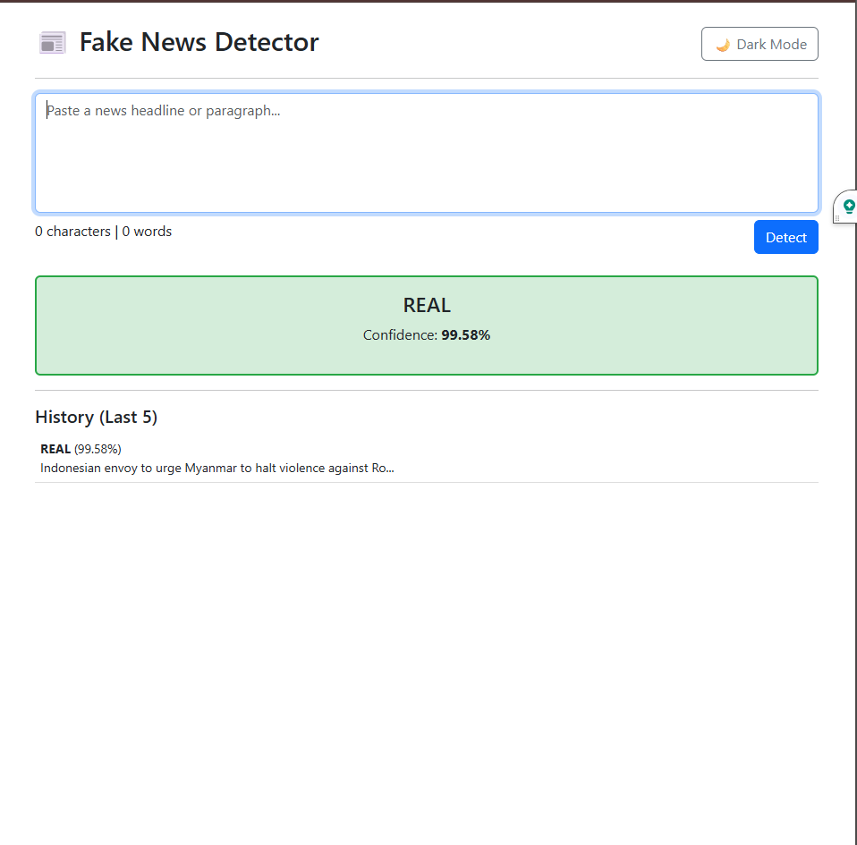
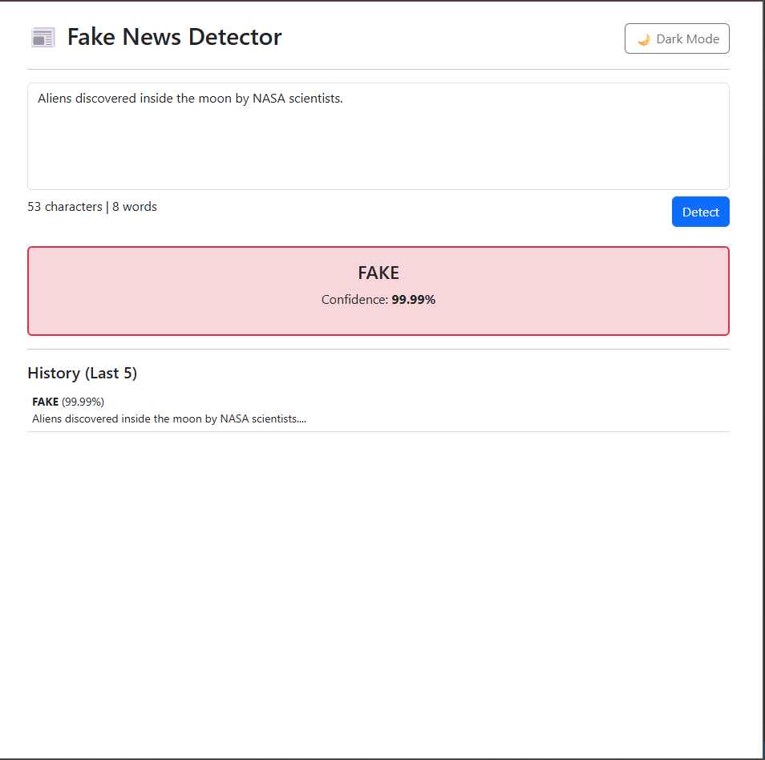
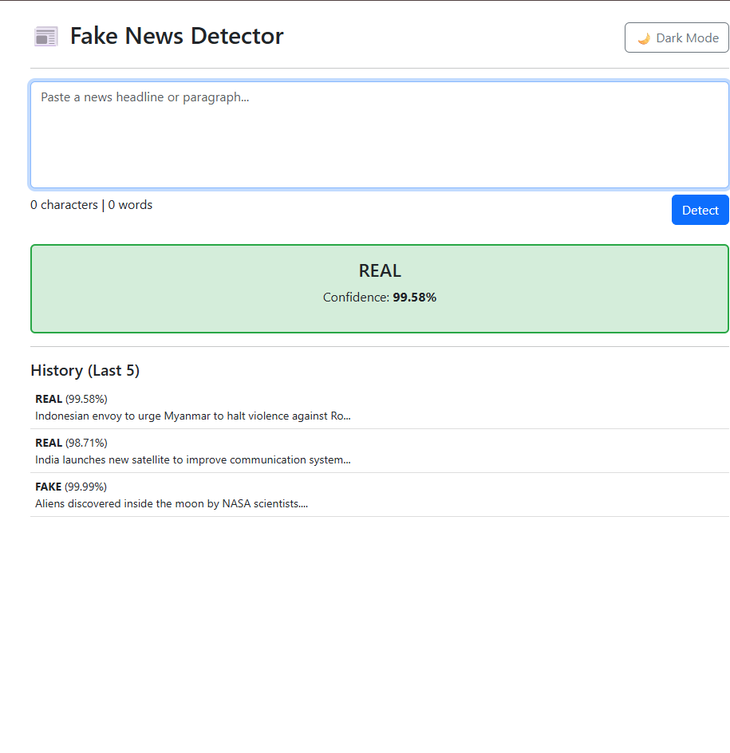
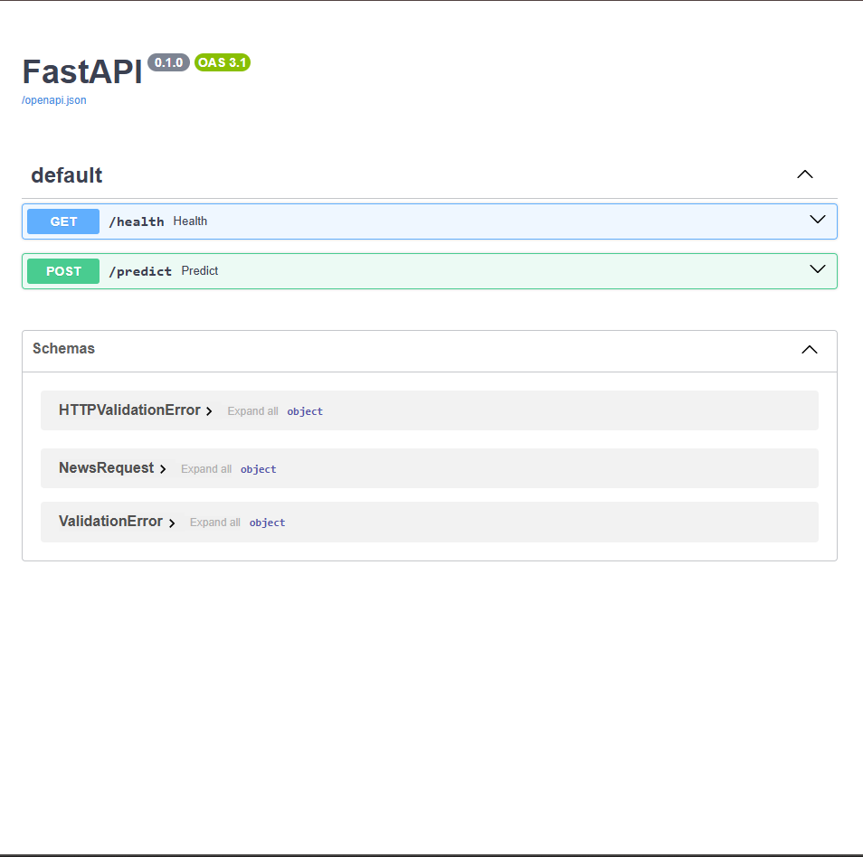

# Fake News Detector

A web application that detects whether a news headline or article snippet is **Real or Fake** using a trained Machine Learning model.

## Features

- DistilBERT Fake News Classification
- TF-IDF + Logistic Regression baseline
- FastAPI backend with `/predict` endpoint
- Interactive frontend UI
- Dark mode
- History panel
- Confidence score visualization

## Tech Stack

Frontend:
- HTML
- CSS
- Vanilla JavaScript
- Bootstrap

Backend:
- FastAPI
- PyTorch
- HuggingFace Transformers

Machine Learning:
- ISOT Fake News Dataset
- TF-IDF
- Logistic Regression
- DistilBERT

## Run Backend

```bash
uvicorn backend.app:app --reload

API:

POST /predict

Example request:

{
"text": "NASA confirms presence of water on Mars"
}

Example response:

{
"label": "REAL",
"confidence": 96.4
}

---








