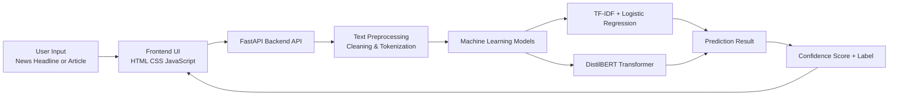
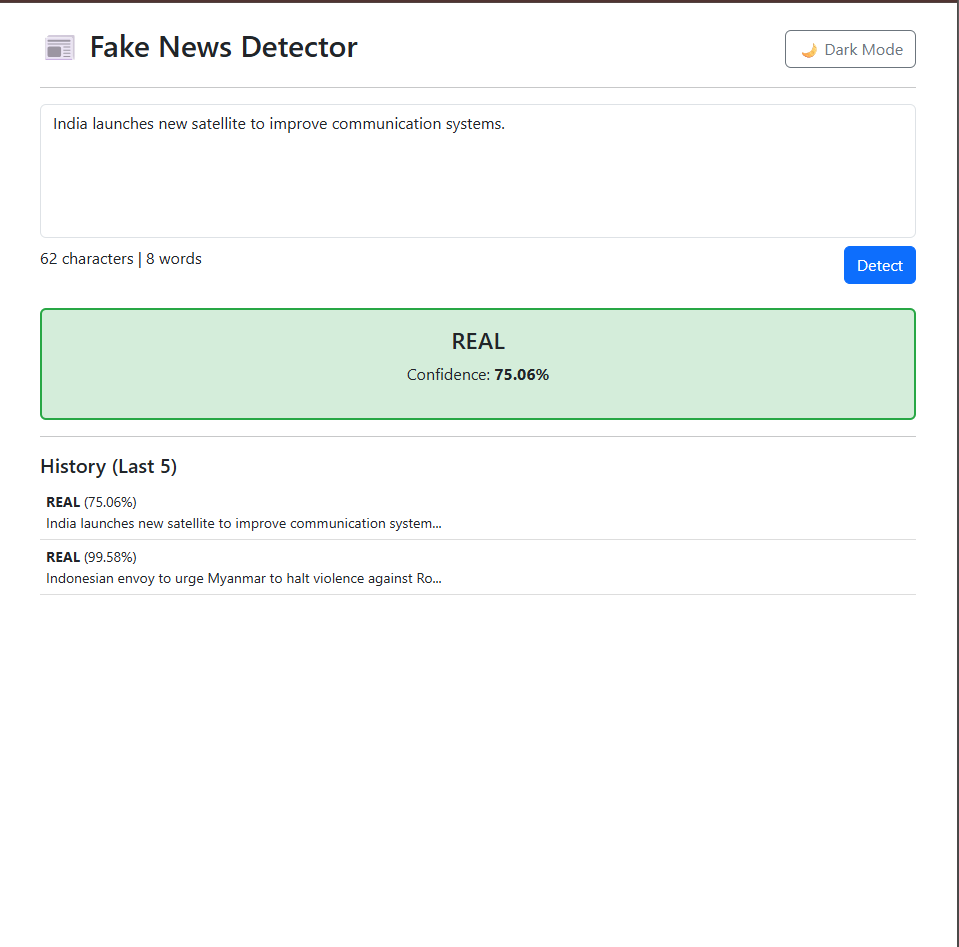

# Fake News Detector


A full-stack **Machine Learning web application** that detects whether a news headline or article snippet is **REAL or FAKE** using Natural Language Processing models.

The system combines a **traditional TF-IDF + Logistic Regression baseline model** with a **fine-tuned DistilBERT transformer model** and exposes predictions through a **FastAPI backend API** with an interactive web interface.

---

## Live Demo

Frontend:
https://fake-news-detector-srijata-moitra.vercel.app

API:
https://fake-news-detector-srijata-moitra.onrender.com

---

# Features

* Fake news detection using **DistilBERT Transformer**
* Baseline classifier using **TF-IDF + Logistic Regression**
* **FastAPI REST API**
* Interactive **frontend UI**
* **Confidence score visualization**
* **Prediction history panel**
* **Dark mode toggle**
* **Character and word counter**
* **Mobile responsive interface**

---

# Tech Stack

## Frontend

* HTML
* CSS
* Vanilla JavaScript
* Bootstrap

## Backend

* FastAPI
* Python
* PyTorch
* HuggingFace Transformers

## Machine Learning

* ISOT Fake News Dataset
* TF-IDF Vectorization
* Logistic Regression
* DistilBERT Transformer

---

# System Architecture



---

# Application Screenshots

## User Interface


---

## Real News Prediction


---

## Fake News Detection


---

## Prediction History



---

## FastAPI Documentation


---

# Dataset

This project uses the **ISOT Fake News Dataset** containing labeled fake and real news articles.

Dataset files:

```
Fake.csv
True.csv
```

---

# Machine Learning Pipeline

1. Load dataset using **Pandas**
2. Merge real and fake datasets
3. Assign labels (Fake = 0, Real = 1)
4. Clean text (lowercase, punctuation removal)
5. Train/test split (80/20)
6. TF-IDF vectorization
7. Train classifiers
8. Evaluate model performance
9. Save trained models

---

# Model Performance

Baseline Model: **TF-IDF + Logistic Regression**

| Metric    | Score      |
| --------- | ---------- |
| Accuracy  | **98.74%** |
| Precision | 0.99       |
| Recall    | 0.99       |
| F1 Score  | 0.99       |

A **DistilBERT transformer model** is also fine-tuned for contextual language understanding.

---

# API Endpoint

### POST `/predict`

Example request

```json
{
"text": "NASA confirms presence of water on Mars"
}
```

Example response

```json
{
"label": "REAL",
"confidence": 96.4
}
```

---

# Running the Project

## Install dependencies

```
pip install -r backend/requirements.txt
```

---

## Start backend server

```
uvicorn backend.app:app --reload
```

Server runs at

```
http://127.0.0.1:8000
```

API docs

```
http://127.0.0.1:8000/docs
```

---

## Launch frontend

Open:

```
frontend/index.html
```

in your browser.

---

# Project Structure

```
fake-news-detector
│
├ backend
│   ├ app.py
│   ├ train_model.py
│   └ requirements.txt
│
├ frontend
│   └ index.html
│
├ images
│   ├ ui.png
│   ├ real_prediction.png
│   ├ fake_prediction.png
│   ├ history.png
│   └ api_docs.png
│
├ README.md
├ .gitignore
└ Fake_News_Detector.docx
```

---

# Future Improvements

* URL based news article extraction
* Multilingual fake news detection
* Explainable AI visualizations
* Docker deployment
* Real time news monitoring

---

# License

This project is intended for **educational and research purposes**.

---
